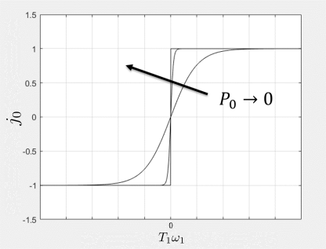

1D model of a heavy construction machine.

### Component type
Signal

### Input Variables
* **eta_0** - Final gear efficiency [-]
* **p** - Grade of road [%]
* **B** - Viscous friction [Ns/m]
* **Cr** - Coefficient of rolling resistance [-]

### Output Variables
* **Fr** - Rolling resistance force [N]
* **FB** - Resistance force due to viscous friction [N]
* **Fg** - Resistance force due to gravitation [N]
* **Jeq** - Equivalent rotational inertia (=m*(rw*i0)^2) [kgm^2]

### Constants
* **m** - Vehicle mass [kg]
* **i0** - Final gear ratio [-]
* **rw** - Wheel radius [m]
* **v0** - Nominal vehicle velocity (to dampen rolling resistance force near 0 velocity) [m/s]
* **P0** - Nominal power flow (to dampen final gear efficiency near 0 power flow) [W]

### Port Initial Conditions
The component is a Q-type which means that it reads the values on all ports and updates the corresponding outputs during initialisation. 

<!--- ### Tips--->

## Theory
This is a simple 1D vehicle model based on Newton's second law of motion:

<!---EQUATION F_t-F_B-F_g-F_r-F2 = \dot{v}_2 m ~~~(1) --->

where 

<!---EQUATION F_t = \frac{T_1}{r_w i_0}\eta_0^{j_0}, j_0 = \begin{cases}1 &, T_1\omega_1>0\\-1 &, T_1\omega_1\leq 0\end{cases} ~~~(2) --->

<!---EQUATION F_B = v_2 B ~~~(3) --->

<!---EQUATION F_g = m g \sin \gamma ~~~(4) --->

<!---EQUATION F_r = C_r j_r m g \cos \gamma, j_r = \begin{cases}1 &, v_2>0\\-1 &, v_2\leq 0\end{cases} ~~~(5) --->

and

<!---EQUATION \omega_1 =-\frac{v_2}{i_0r_w} ~~~(6) --->

<!---EQUATION J_{eq} =m\left(r_w i_0\right)^2 ~~~(7) --->

 
### Implementation adaptation
The vehicle is implemented as a q-type component, which means that it determines the flow and effort variables at the power ports. First, introduce the TLM equations:

<!---EQUATION T_{1} =c_1 + Z_{c1}\omega_1 ~~~(8) --->

<!---EQUATION F_{2} =c_2 + Z_{c2} v_2 ~~~(9) --->

Combine equations (1)-(9), laplace transform and solve for **v2**:

<!---EQUATION v_{2} =\frac{\frac{c_1}{i_0 r_w}\eta_0^{j_0} - mg\sin \gamma - C_r m g\cos(\gamma)j_r - c_2}{B + \frac{Zc1}{(i_0 r_w)^2}\eta_0^{j_0}+Z_{c2} + m\cdot s} ~~~(10) --->

Equation (10) is solved using bilinear transform for each timestep. Once **v2** has been updated, **w1** can be updated according to equation (6). **T1** and **F2** are then updated according to equations (8) and (9).

#### The efficiency flip

To avoid oscillations near zero velocity and zero power flow, the flip of the final gear efficiency and the rolling resistance are implemented as sigmoid functions:

<!---EQUATION j_0 = \begin{cases}1 &, T_1\omega_1>0\\-1 &, T_1\omega_1\leq 0\end{cases} \approx 2 \frac{1}{1+e^{-\frac{T_1\omega_1}{P_0}}} - 1~~~(11) --->

<!---EQUATION F_r = C_r j_r m g \cos \gamma, j_r = \begin{cases}1 &, v_2>0\\-1 &, v_2\leq 0\end{cases} \approx 2 \frac{1}{1+e^{-\frac{v_2{v_0}}} - 1 ~~~(12) --->

where **P0** and **v0** are tuning parameters. The effect of varying **P0** is illustrated below:

