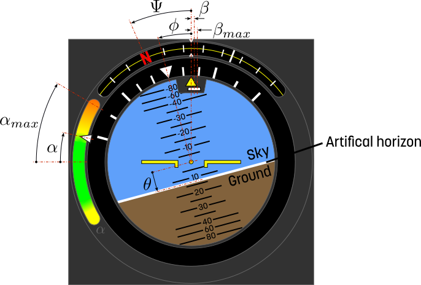

Visualisation component of an attitude indicator instrument. The component reads the simulated angles from an aircraft model and animates the indicator accordingly during animation.

### Component type
Signal/Animation

### Input Variables
* **Phi** - Bank angle [rad]
* **Theta** - Pitch angle [rad]
* **Psi** - Heading angle [rad]
* **Alpha** - Angle of attack [rad]
* **AlphaMax** - Maximum angle of attack (used to change the range of the Aoa indicator) [rad]
* **Beta** - Sideslip angle [rad]
* **BetaMax** - Maximum sideslip angle (used to change the range of the beta indicator) [rad]

Note that the range for **Theta** is non-linear, i.e. horizon moves twice as fast for abs(**Theta**)>40 degrees.

<!---EQUATION --->