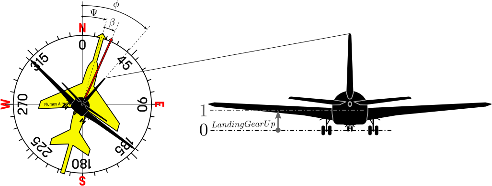

Visualisation component for bank, heading and sideslip angles. The component reads the simulated angles from an aircraft model and animates the indicator accordingly during animation.

Note that the aircraft is viewed from behind (facing away from the user).

### Component type
Signal/Animation

### Input Variables
* **Psi** - Heading angle [rad]
* **phi** - Bank angle [rad]
* **beta** - Sideslip angle [rad]
* **LandingGearUp** - Landing gear up (1) or down (0) [-]

Note: **LandingGearUp** may be used to linearly move the landing gear between fully up (1, default) or fully down (0).

<!---EQUATION --->