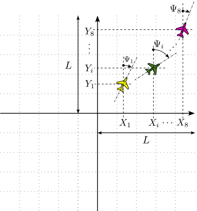

Visualisation component for trajectory of 8 planes. The component reads the X and Y coordinates and heading angle from another simulation model and moves and rotates the different planes on XY-plane accordingly.

### Component type
Signal/Animation

### Constants
* **NoPlanes** - Numberof planes to show in the animation

### Input Variables
* **Xi** - Vehicle center point X-coordinate of plane i [m]
* **Yi** - Vehicle center point Y-coordinate of plane i [m]
* **Psii** - Heading angle of plane i [rad]
* **L** - Width of quadrant [m]

The **L** parameter may be used to scale the motion of the plane, since the size of the mission could vary greatly.

### Colors
The different planes are identified by different colors.

| Plane number | Color | [RGB]         |
|:------------:|:-----| :------------ |
|1             |Yellow | [248 248 0  ] |
|2             |Green  | [68  120 33 ] |
|3             |Red    | [248 46  0  ] |
|4             |Blue   | [55  113 200] |
|5             |Black  | [0   0   0  ] |
|6             |Grey   | [100 100 100] |
|7             |Brown  | [170 68  0  ] |
|8             |Purple | [212 0   170] |

<!---EQUATION --->