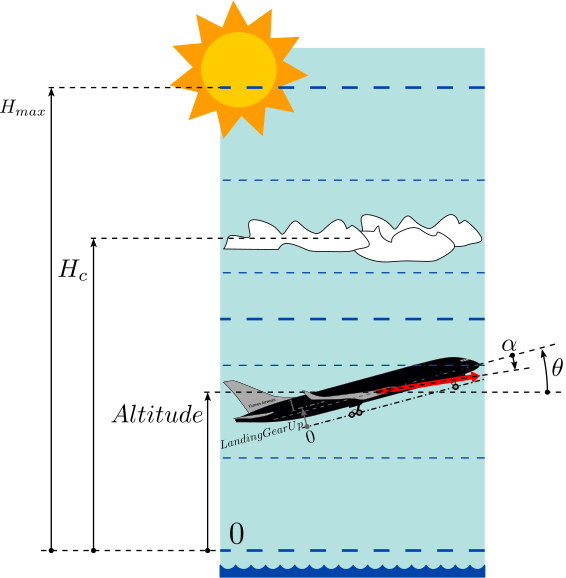

Visualised indicator for pitch angle, altitude and angle of attack for aircraft simulation. The component reads pitch angle, altitude and angle of attack that are output from an aircraft simulation model. The values are directly used to animate the indicator in animation mode.

### Component type
Signal/Animation

### Input Variables
* **Theta** - Pitch angle [rad]
* **Altitude** - Altitude [m]
* **Alpha** - Angle of attack [rad]
* **HC** - Cloud altitude [m]
* **HMax** - Maximum altitude [m]
* **LandingGearUp** - Landing gear up (1) or down (0) [-]

Note 1: **HMax** may be altered to change the resolution of the altitude. 

Note 2: **LandingGearUp** may be used to linearly move the landing gear between fully up (1, default) or fully down (0).

<!---EQUATION --->